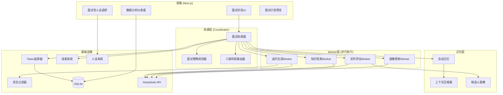

# 🔍 从 Claude Code 源码中借鉴的功能模块 — 面试Agent毕设增强方案

> **背景：** 当前面试Agent系统已实现基础的多Agent面试对话流程，但作为211本科毕设，工作量和技术深度还需提升。本文档通过深入分析 Claude Code 源码架构，提取可迁移到面试Agent系统中的核心设计思想和功能模块。

---

## 一、Claude Code 核心架构概览

通过阅读源码，Claude Code 的核心架构包含以下关键模块：

| 模块 | 源码位置 | 核心能力 |
|------|---------|---------|
| **Tool 抽象系统** | `src/Tool.ts` | 统一的工具注册、权限校验、输入验证、结果渲染 |
| **多Agent协调器** | `src/coordinator/coordinatorMode.ts` | Coordinator-Worker 模式，并行任务调度 |
| **会话记忆系统** | `src/services/SessionMemory/` | 结构化会话笔记，跨轮次记忆持久化 |
| **上下文压缩** | `src/services/compact/` | 对话过长时自动摘要压缩，保留关键信息 |
| **记忆提取** | `src/services/extractMemories/` | 后台自动从对话中提取长期记忆 |
| **验证Agent** | `src/tools/AgentTool/built-in/verificationAgent.ts` | 独立验证子Agent，对实现结果做PASS/FAIL判定 |
| **规划模式** | `src/tools/EnterPlanModeTool/` | 先规划后执行的两阶段工作模式 |
| **技能系统** | `src/tools/SkillTool/` | 可扩展的技能注册与发现机制 |
| **Token消耗追踪** | `src/cost-tracker.ts` | 精确的Token用量统计与成本分析 |
| **任务系统** | `src/Task.ts` | 异步任务管理，状态追踪，生命周期管理 |
| **语音交互** | `src/services/voice.ts` | 多后端音频录制，静音检测，麦克风权限管理 |
| **会话历史** | `src/history.ts` | 持久化会话历史，支持恢复和搜索 |

---

## 二、可借鉴的功能模块（按推荐优先级排序）

### ⭐⭐⭐ P0 — 强烈推荐（显著提升工作量+技术深度）

---

### 2.1 多Agent协调器模式（Coordinator-Worker Pattern）

**Claude Code 源码参考：** `src/coordinator/coordinatorMode.ts`

**核心思想：** Claude Code 采用 Coordinator-Worker 架构，Coordinator 负责任务分解和调度，Worker 负责具体执行。Worker 之间可以并行运行，Coordinator 综合结果后反馈给用户。

**迁移到面试Agent的方案：**

```
当前架构（单线程顺序执行）：
  用户回答 → 单个Agent生成回复 → 返回

增强架构（Coordinator-Worker）：
  用户回答 → Coordinator 分发任务
              ├── 评估Worker：实时评分当前回答（后台异步）
              ├── 追问Worker：生成追问问题
              ├── 知识检索Worker：从题库检索相关知识点
              └── Coordinator 综合结果 → 生成最终回复
```

**具体实现：**

```python
# backend/agent/coordinator.py

class InterviewCoordinator:
    """
    面试协调器 — 借鉴 Claude Code 的 Coordinator-Worker 模式
    
    职责：
    1. 将用户回答分发给多个 Worker 并行处理
    2. 综合各 Worker 结果生成最终回复
    3. 管理 Worker 生命周期
    """
    
    def __init__(self, resume_data, position):
        self.workers = {
            "evaluator": EvaluationWorker(),      # 实时评分
            "questioner": QuestionWorker(),        # 生成追问
            "knowledge": KnowledgeWorker(),        # 知识检索
            "profile_updater": ProfileWorker(),    # 画像更新
        }
    
    async def process_answer(self, user_msg, stage, context):
        """并行分发任务给各 Worker"""
        tasks = [
            worker.process(user_msg, stage, context)
            for worker in self.workers.values()
        ]
        results = await asyncio.gather(*tasks)
        return self.synthesize(results)
    
    def synthesize(self, worker_results):
        """综合各 Worker 结果，生成最终面试官回复"""
        ...
```

**新增代码量估算：** ~400行  
**论文亮点：** 可以画架构图，对比单Agent vs 多Agent协调器的响应质量和延迟

---

### 2.2 会话记忆与上下文压缩系统

**Claude Code 源码参考：**
- `src/services/SessionMemory/prompts.ts` — 结构化会话笔记模板
- `src/services/compact/prompt.ts` — 上下文压缩 Prompt

**核心思想：** Claude Code 维护一份结构化的 Session Memory（包含 Current State、Task Specification、Files and Functions、Errors & Corrections 等固定章节），当对话过长时自动触发 Compact（压缩），将历史对话摘要为结构化笔记，保留关键信息的同时大幅减少 Token 消耗。

**迁移到面试Agent的方案：**

面试场景天然适合这个设计！面试对话可能很长（8-10轮），但 LLM 的上下文窗口有限。

```python
# backend/agent/session_memory.py

class InterviewSessionMemory:
    """
    面试会话记忆 — 借鉴 Claude Code 的 SessionMemory 设计
    
    维护一份结构化的面试笔记，实时更新：
    """
    
    TEMPLATE = """
    # 候选人基本信息
    _姓名、学校、专业、目标岗位_
    
    # 当前面试进度
    _当前阶段、已完成阶段、剩余阶段_
    
    # 各阶段表现记录
    ## 开场阶段
    _候选人自我介绍要点_
    
    ## 编程阶段
    _题目、解题思路、代码质量、复杂度分析_
    
    ## 基础知识阶段
    _问答记录：问题→回答质量→知识盲点_
    
    ## 项目深挖阶段
    _项目名称、技术栈、个人贡献、STAR分析_
    
    # 候选人画像
    _技术深度、沟通能力、逻辑思维、学习能力_
    
    # 已发现的优势
    _列表_
    
    # 已发现的不足
    _列表_
    
    # 待追问的方向
    _下一步应该追问什么_
    """
```

**上下文压缩（Compact）：**

```python
# backend/agent/context_compactor.py

class ContextCompactor:
    """
    上下文压缩器 — 借鉴 Claude Code 的 Compact 机制
    
    当对话历史超过阈值时，自动将早期对话压缩为摘要，
    保留最近N轮原始对话 + 结构化摘要。
    """
    
    MAX_CONTEXT_TOKENS = 4000  # 上下文Token上限
    KEEP_RECENT_TURNS = 4      # 保留最近4轮原始对话
    
    async def compact_if_needed(self, messages, session_memory):
        """检查是否需要压缩，如需要则执行"""
        token_count = self.estimate_tokens(messages)
        if token_count > self.MAX_CONTEXT_TOKENS:
            summary = await self.generate_summary(messages)
            session_memory.update(summary)
            # 返回：摘要 + 最近N轮原始对话
            return self.build_compacted_context(summary, messages)
        return messages
```

**新增代码量估算：** ~350行  
**论文亮点：** 可以做实验对比压缩前后的Token消耗和回复质量，画Token消耗曲线图

---

### 2.3 实时评估Worker（借鉴 Verification Agent）

**Claude Code 源码参考：** `src/tools/AgentTool/built-in/verificationAgent.ts`

**核心思想：** Claude Code 有一个独立的 Verification Agent，它的唯一职责是验证实现是否正确，输出结构化的 PASS/FAIL/PARTIAL 判定。它有严格的行为约束（只读、不能修改代码），并要求每个检查都有 Command → Output → Result 的证据链。

**迁移到面试Agent的方案：**

创建一个独立的 **实时评估Agent**，在面试过程中后台异步评估每一轮回答：

```python
# backend/agent/evaluation_agent.py

class RealTimeEvaluationAgent:
    """
    实时评估Agent — 借鉴 Claude Code 的 Verification Agent
    
    职责：
    1. 每轮回答后异步评估（不阻塞主对话流）
    2. 输出结构化评分（维度分+证据）
    3. 评估结果反馈给主Agent，影响后续提问策略
    
    评估维度：
    - 技术准确性 (0-100)
    - 回答完整度 (0-100)  
    - 表达清晰度 (0-100)
    - 思维深度 (0-100)
    """
    
    EVALUATION_PROMPT = """
    你是一位面试评估专家。请对候选人的回答进行客观评估。
    
    面试问题：{question}
    候选人回答：{answer}
    参考要点：{reference_points}
    
    请以JSON格式输出评估结果：
    {
        "technical_accuracy": {"score": 0-100, "evidence": "..."},
        "completeness": {"score": 0-100, "evidence": "..."},
        "clarity": {"score": 0-100, "evidence": "..."},
        "depth": {"score": 0-100, "evidence": "..."},
        "verdict": "EXCELLENT/GOOD/FAIR/POOR",
        "follow_up_suggestion": "建议追问的方向"
    }
    """
    
    async def evaluate(self, question, answer, context):
        """异步评估单轮回答"""
        ...
    
    async def generate_final_report(self, all_evaluations):
        """基于所有轮次评估生成最终报告"""
        ...
```

**新增代码量估算：** ~300行  
**论文亮点：** 可以对比"有实时评估反馈"vs"无实时评估"的面试质量差异

---

### ⭐⭐ P1 — 推荐（增加系统完整性和技术亮点）

---

### 2.4 规划模式（Plan Mode）— 面试策略规划器

**Claude Code 源码参考：** `src/tools/EnterPlanModeTool/prompt.ts`

**核心思想：** Claude Code 在执行复杂任务前会进入 Plan Mode（规划模式），先探索代码库、设计方案、获得用户确认后再执行。这是一种"先想后做"的策略。

**迁移到面试Agent的方案：**

在面试开始前，Agent 先分析简历，生成一份**面试策略规划**：

```python
# backend/agent/interview_planner.py

class InterviewPlanner:
    """
    面试策略规划器 — 借鉴 Claude Code 的 Plan Mode
    
    在面试开始前，基于简历分析生成个性化面试计划：
    1. 分析简历亮点和疑点
    2. 为每个阶段规划具体问题方向
    3. 设定难度梯度
    4. 预设追问路径（决策树）
    """
    
    async def generate_plan(self, resume_data, position):
        """生成面试策略规划"""
        plan = await self.llm_call(
            PLANNING_PROMPT.format(
                resume=resume_data,
                position=position
            )
        )
        return InterviewPlan.from_json(plan)


class InterviewPlan:
    """结构化面试计划"""
    
    resume_highlights: List[str]       # 简历亮点（值得深挖）
    resume_concerns: List[str]         # 简历疑点（需要验证）
    stage_plans: Dict[str, StagePlan]  # 每阶段的具体计划
    difficulty_curve: str              # 难度曲线策略
    estimated_duration: int            # 预估时长（分钟）
    
    
class StagePlan:
    """单阶段计划"""
    
    focus_areas: List[str]             # 重点考察方向
    planned_questions: List[str]       # 预设问题池
    follow_up_tree: Dict               # 追问决策树
    max_questions: int                 # 本阶段最大问题数
    difficulty_level: str              # 难度级别
```

**新增代码量估算：** ~250行  
**论文亮点：** 可以展示面试计划的可视化（决策树图），体现系统的"智能规划"能力

---

### 2.5 Token消耗追踪与成本分析

**Claude Code 源码参考：** `src/cost-tracker.ts`

**核心思想：** Claude Code 精确追踪每次 API 调用的 Token 消耗（input/output/cache_read/cache_creation），按模型分类统计，计算美元成本，并支持会话级别的成本恢复。

**迁移到面试Agent的方案：**

```python
# backend/services/token_tracker.py

class TokenTracker:
    """
    Token消耗追踪器 — 借鉴 Claude Code 的 cost-tracker
    
    追踪每次面试的LLM调用成本：
    1. 每轮对话的 input/output tokens
    2. 各阶段的Token消耗分布
    3. 总成本计算
    4. 成本优化建议
    """
    
    def __init__(self):
        self.records = []
        self.stage_usage = defaultdict(lambda: {
            "input_tokens": 0,
            "output_tokens": 0, 
            "api_calls": 0,
            "cost_usd": 0.0
        })
    
    def record(self, stage, input_tokens, output_tokens, model):
        """记录一次API调用"""
        cost = self.calculate_cost(input_tokens, output_tokens, model)
        self.stage_usage[stage]["input_tokens"] += input_tokens
        self.stage_usage[stage]["output_tokens"] += output_tokens
        self.stage_usage[stage]["api_calls"] += 1
        self.stage_usage[stage]["cost_usd"] += cost
        
    def get_report(self):
        """生成Token消耗报告"""
        return {
            "total_tokens": self.total_tokens,
            "total_cost_usd": self.total_cost,
            "stage_breakdown": dict(self.stage_usage),
            "avg_tokens_per_turn": self.avg_tokens_per_turn,
            "optimization_suggestions": self.get_suggestions()
        }
```

**新增代码量估算：** ~150行  
**论文亮点：** 可以画各阶段Token消耗的饼图/柱状图，分析成本优化空间

---

### 2.6 面试技能系统（Skill System）

**Claude Code 源码参考：** `src/tools/SkillTool/prompt.ts`, `src/skills/`

**核心思想：** Claude Code 有一套可扩展的 Skill 系统，技能可以通过配置文件注册，运行时动态发现和调用。每个 Skill 有 `whenToUse` 描述，Agent 根据上下文自动选择合适的 Skill。

**迁移到面试Agent的方案：**

将面试中的各种能力抽象为"技能"，支持插件化扩展：

```python
# backend/skills/base.py

class InterviewSkill(ABC):
    """面试技能基类"""
    
    name: str                    # 技能名称
    description: str             # 技能描述
    when_to_use: str            # 何时使用
    
    @abstractmethod
    async def execute(self, context: SkillContext) -> SkillResult:
        """执行技能"""
        ...

# 内置技能示例：
class StarMethodSkill(InterviewSkill):
    """STAR追问法技能"""
    name = "star_method"
    when_to_use = "当需要深入了解候选人的项目经历时"

class DifficultyAdaptSkill(InterviewSkill):
    """难度自适应技能"""
    name = "difficulty_adapt"  
    when_to_use = "当需要根据候选人表现动态调整问题难度时"

class CodeReviewSkill(InterviewSkill):
    """代码审查技能"""
    name = "code_review"
    when_to_use = "当候选人提交代码需要专业点评时"

class KnowledgeGraphSkill(InterviewSkill):
    """知识图谱关联技能"""
    name = "knowledge_graph"
    when_to_use = "当需要从一个知识点关联到相关知识点进行追问时"
```

**新增代码量估算：** ~300行  
**论文亮点：** 体现系统的可扩展性设计，可以画技能注册/发现/调用的流程图

---

### 2.7 面试官人设系统（借鉴 Agent Definition）

**Claude Code 源码参考：** `src/tools/AgentTool/loadAgentsDir.ts`, `src/tools/AgentTool/built-in/`

**核心思想：** Claude Code 的 Agent 系统支持通过配置文件定义不同类型的 Agent（如 verification、plan、explore），每个 Agent 有独立的 System Prompt、可用工具列表、行为约束。

**迁移到面试Agent的方案：**

```python
# backend/agent/personas/

# persona_strict.yaml
name: "严格型面试官"
style: "严谨、直接、注重技术深度"
system_prompt: |
  你是一位来自大厂的资深技术面试官，面试风格严谨。
  你会直接指出候选人回答中的错误，追问技术细节。
  不会给模糊的回答放水。
temperature_bias: -0.1
follow_up_aggressiveness: "high"

# persona_friendly.yaml  
name: "友好型面试官"
style: "温和、鼓励、注重引导"
system_prompt: |
  你是一位友好的技术面试官，善于引导候选人。
  当候选人回答不完整时，你会给出提示而非直接否定。
  注重发现候选人的潜力。
temperature_bias: +0.1
follow_up_aggressiveness: "low"

# persona_pressure.yaml
name: "压力面试官"  
style: "高压、快节奏、连续追问"
system_prompt: |
  你是一位压力面试官，模拟高压面试场景。
  你会快速连续追问，测试候选人的抗压能力和临场反应。
temperature_bias: 0
follow_up_aggressiveness: "very_high"
```

```python
# backend/agent/persona_loader.py

class PersonaLoader:
    """面试官人设加载器"""
    
    def load_all(self) -> List[InterviewerPersona]:
        """从 YAML 配置文件加载所有人设"""
        ...
    
    def get_persona(self, name: str) -> InterviewerPersona:
        """获取指定人设"""
        ...
```

**新增代码量估算：** ~200行 + YAML配置  
**论文亮点：** 可以做用户实验，对比不同面试官人设下候选人的体验差异

---

### ⭐ P2 — 可选（锦上添花，进一步增加深度）

---

### 2.8 会话历史持久化与恢复

**Claude Code 源码参考：** `src/history.ts`

**核心思想：** Claude Code 将所有会话历史持久化到 JSONL 文件，支持按项目过滤、按会话分组、搜索历史、恢复中断的会话。

**迁移方案：** 支持面试中断后恢复（断线重连），面试历史回放。

**新增代码量估算：** ~150行

---

### 2.9 安全过滤增强（借鉴 Safety Filter + Permission System）

**Claude Code 源码参考：** `src/tools/BashTool/bashSecurity.ts`

**核心思想：** Claude Code 有多层安全机制：输入验证、权限检查、危险操作警告、只读模式。

**迁移方案：** 增强面试Agent的安全过滤：
- 防止 Prompt 注入（候选人试图操控面试官）
- 敏感信息检测（候选人泄露公司机密）
- 回答质量异常检测（疑似AI代答）

```python
class EnhancedSafetyFilter:
    """增强安全过滤器"""
    
    async def check_prompt_injection(self, user_msg):
        """检测候选人是否试图注入Prompt"""
        injection_patterns = [
            r"忽略.*指令", r"你现在是", r"扮演.*角色",
            r"ignore.*instructions", r"you are now",
        ]
        ...
    
    async def check_ai_generated(self, answer):
        """检测回答是否疑似AI生成"""
        # 基于文本特征（过于完美的结构、特定句式）
        ...
    
    async def check_sensitive_info(self, text):
        """检测是否包含敏感信息"""
        ...
```

**新增代码量估算：** ~200行  
**论文亮点：** 安全性分析章节，展示防御策略

---

### 2.10 面试数据分析仪表盘

**Claude Code 源码参考：** `src/context/stats.tsx`, `src/cost-tracker.ts`

**迁移方案：** 前端增加数据分析页面：
- 面试时长分布图
- 各阶段耗时占比
- 候选人评分雷达图
- 历史面试趋势分析
- Token消耗统计

**新增代码量估算：** ~300行（前端）

---

## 三、增强后的系统架构图



---

## 四、工作量估算汇总

| 模块 | 优先级 | 新增代码量 | 技术难度 | 论文价值 |
|------|:------:|:---------:|:-------:|:-------:|
| 多Agent协调器 | P0 | ~400行 | ⭐⭐⭐ | ⭐⭐⭐ |
| 会话记忆+上下文压缩 | P0 | ~350行 | ⭐⭐⭐ | ⭐⭐⭐ |
| 实时评估Agent | P0 | ~300行 | ⭐⭐ | ⭐⭐⭐ |
| 面试策略规划器 | P1 | ~250行 | ⭐⭐ | ⭐⭐⭐ |
| Token消耗追踪 | P1 | ~150行 | ⭐ | ⭐⭐ |
| 技能系统 | P1 | ~300行 | ⭐⭐ | ⭐⭐ |
| 面试官人设系统 | P1 | ~200行 | ⭐ | ⭐⭐ |
| 会话历史持久化 | P2 | ~150行 | ⭐ | ⭐ |
| 安全过滤增强 | P2 | ~200行 | ⭐⭐ | ⭐⭐ |
| 数据分析仪表盘 | P2 | ~300行 | ⭐⭐ | ⭐⭐ |

**总计新增代码量：~2600行**（全部实现）  
**推荐实现（P0+P1）：~1950行**

加上现有代码（后端~1100行 + 前端~880行），总代码量将达到 **~4900行**，工作量翻倍以上。

---

## 五、论文章节建议

基于以上增强，论文可以增加以下技术章节：

### 5.1 系统架构设计（第三章）
- 多Agent协调器架构图 + 对比分析
- Coordinator-Worker 模式的设计动机和优势
- 与 Claude Code 架构的对比（引用开源项目作为设计参考）

### 5.2 核心算法（第四章）
- **三级阶段路由算法**：关键词→正则→LLM 的级联策略
- **上下文压缩算法**：Token预算管理 + 结构化摘要
- **动态难度调整算法**：基于候选人画像的实时难度曲线
- **面试策略规划算法**：基于简历分析的决策树生成

### 5.3 实验与评估（第五章）
- 实验1：多Agent协调器 vs 单Agent 的回复质量对比
- 实验2：上下文压缩前后的Token消耗和回复质量
- 实验3：不同面试官人设下的用户体验评估
- 实验4：实时评估准确性验证（与人工评分对比）
- 实验5：面试策略规划的有效性（有计划 vs 无计划）

### 5.4 系统特色（可作为创新点）
1. **借鉴工业级AI Agent架构**：参考 Claude Code 的 Coordinator-Worker 模式
2. **结构化会话记忆**：解决长对话中的上下文丢失问题
3. **实时多维度评估**：异步评估不阻塞对话流
4. **可扩展技能系统**：插件化架构支持功能扩展

---

## 六、实施建议

### 推荐实施顺序：

```
第1周：实时评估Agent + Token追踪（最容易出效果）
第2周：会话记忆 + 上下文压缩（核心技术亮点）
第3周：面试策略规划器 + 面试官人设（增加系统完整性）
第4周：多Agent协调器重构（架构升级，最有论文价值）
第5周：技能系统 + 安全过滤增强 + 数据分析仪表盘（锦上添花）
```

### 关键提醒：
1. **每个模块都要有对比实验**，这是毕设论文的核心
2. **画架构图**，用 Mermaid/PlantUML，答辩时视觉效果好
3. **引用 Claude Code 作为设计参考**，体现你的技术视野（"本系统借鉴了业界领先的AI Agent系统架构设计"）
4. **Token消耗数据一定要记录**，这是量化分析的基础

---

## 七、深度挖掘 — 第二轮源码分析新发现

> 以下是对 Claude Code 源码进行第二轮深度阅读后，发现的更多可借鉴的设计模式和功能模块。这些内容比第一轮更加深入，涉及到具体的实现细节和设计哲学。

---

### 7.1 🔥 QueryEngine 核心循环 — 面试引擎重构

**Claude Code 源码参考：** `src/QueryEngine.ts`（1296行，核心中的核心）

**深度分析：** Claude Code 的 `QueryEngine` 是整个系统的心脏。它不是简单的"发消息→收回复"，而是一个完整的**异步生成器驱动的状态机**：

```typescript
// Claude Code 的核心模式：AsyncGenerator 驱动的对话循环
async *submitMessage(prompt): AsyncGenerator<SDKMessage> {
    // 1. 预处理：构建系统提示、加载记忆、处理斜杠命令
    // 2. 进入 query 循环（内部也是 AsyncGenerator）
    for await (const message of query({...})) {
        // 3. 根据消息类型分发处理
        switch (message.type) {
            case 'assistant': // 助手回复 → 持久化 + 流式输出
            case 'user':      // 工具结果 → 推入消息列表
            case 'progress':  // 进度更新 → 实时推送
            case 'system':    // 系统事件 → compact boundary / api error
            case 'attachment': // 附件 → 结构化输出 / max_turns_reached
        }
        // 4. 检查预算限制（Token/USD/轮次）
        if (getTotalCost() >= maxBudgetUsd) { yield error_result; return; }
    }
    // 5. 生成最终结果
    yield { type: 'result', subtype: 'success', ... }
}
```

**关键设计模式：**
- **AsyncGenerator 流式架构**：不是等全部完成再返回，而是逐步 yield 中间结果
- **多层预算控制**：Token 预算、USD 预算、最大轮次，任一超限即停止
- **消息类型分发**：不同类型的消息走不同的处理路径
- **持久化与流式并行**：`void recordTranscript(messages)` 异步持久化不阻塞流式输出

**迁移到面试Agent的方案：**

```python
# backend/agent/interview_engine.py

class InterviewEngine:
    """
    面试引擎 — 借鉴 Claude Code 的 QueryEngine 设计
    
    核心改进：
    1. AsyncGenerator 驱动，支持流式输出 + 中间状态推送
    2. 多层预算控制（Token/轮次/时间）
    3. 消息类型分发（回复/评估/进度/系统事件）
    4. 会话级状态管理（跨轮次持久化）
    """
    
    def __init__(self, config: InterviewEngineConfig):
        self.session_memory = InterviewSessionMemory()
        self.token_tracker = TokenTracker()
        self.evaluation_agent = RealTimeEvaluationAgent()
        self.compactor = ContextCompactor()
        self.messages: List[Message] = []
        self.total_usage = {"input_tokens": 0, "output_tokens": 0}
    
    async def process_turn(
        self, user_msg: str, stage: InterviewStage
    ) -> AsyncIterator[InterviewEvent]:
        """
        处理一轮对话 — AsyncGenerator 模式
        
        Yields:
            InterviewEvent: 不同类型的事件
            - TextChunk: 流式文本片段
            - EvaluationResult: 后台评估结果
            - StageTransition: 阶段切换通知
            - ProgressUpdate: 进度更新
            - BudgetWarning: 预算警告
        """
        # 1. 上下文压缩检查
        compacted = await self.compactor.compact_if_needed(
            self.messages, self.session_memory
        )
        
        # 2. 并行启动：生成回复 + 后台评估
        reply_task = asyncio.create_task(
            self._generate_reply(user_msg, stage, compacted)
        )
        eval_task = asyncio.create_task(
            self.evaluation_agent.evaluate_async(user_msg, stage)
        )
        
        # 3. 流式输出回复
        async for chunk in self._stream_reply(reply_task):
            yield InterviewEvent(type="text_chunk", data=chunk)
            
        # 4. 检查预算
        if self.token_tracker.is_over_budget():
            yield InterviewEvent(type="budget_warning", 
                                 data=self.token_tracker.get_report())
        
        # 5. 检查阶段转换
        transition = await self._check_stage_transition(stage)
        if transition:
            yield InterviewEvent(type="stage_transition", data=transition)
        
        # 6. 返回评估结果（如果已完成）
        if eval_task.done():
            yield InterviewEvent(type="evaluation", data=eval_task.result())
        
        # 7. 更新会话记忆
        await self.session_memory.update_from_turn(user_msg, reply_text, stage)
```

**新增代码量估算：** ~350行  
**论文亮点：** 这是整个系统的架构核心，可以画详细的时序图展示一轮对话的完整生命周期

---

### 7.2 🔥 结构化会话笔记的精确模板设计

**Claude Code 源码参考：** `src/services/SessionMemory/prompts.ts`（325行）

**深度分析：** Claude Code 的 Session Memory 不是简单的"记住对话"，而是一套精心设计的**结构化笔记系统**：

```
# Session Title                    ← 5-10字的信息密集标题
# Current State                    ← 当前正在做什么（最关键！）
# Task specification               ← 用户要求构建什么
# Files and Functions              ← 重要文件及其作用
# Workflow                         ← 常用命令和执行顺序
# Errors & Corrections             ← 错误及修复方法
# Codebase and System Documentation ← 系统组件如何协作
# Learnings                        ← 什么有效/什么无效
# Key results                      ← 关键输出结果
# Worklog                          ← 逐步工作日志
```

**关键设计细节（源码中的精华）：**

1. **Section 级别的 Token 预算管理**：每个 section 最多 2000 tokens，总计最多 12000 tokens
2. **模板保护机制**：更新时**绝不允许修改 section 标题和斜体描述行**，只更新内容
3. **自动膨胀检测**：如果某个 section 超过预算，自动生成压缩提醒
4. **空检测**：`isSessionMemoryEmpty()` 判断笔记是否还是空模板，决定是否回退到传统 compact

**迁移到面试Agent — 面试笔记模板：**

```python
INTERVIEW_SESSION_MEMORY_TEMPLATE = """
# 面试标题
_候选人姓名 - 目标岗位 - 面试日期_

# 当前状态
_当前正在进行的面试阶段，下一步计划_

# 候选人档案
_姓名、学校、专业、学历、核心技能栈_

# 各阶段表现记录
## 开场（自我介绍）
_候选人介绍要点、第一印象_

## 编程考察
_题目名称、解题思路、代码质量评价、时间复杂度、是否有优化思路_

## 基础知识
_Q1: 问题 → 回答质量(好/中/差) → 关键知识点_
_Q2: ..._

## 项目深挖
_项目名称、技术栈、个人角色、STAR分析、追问记录_

# 候选人能力画像
_技术深度(1-5)、沟通表达(1-5)、逻辑思维(1-5)、学习能力(1-5)、抗压能力(1-5)_

# 已发现的优势
_具体的、可引用的优势列表_

# 已发现的不足
_具体的、可引用的不足列表_

# 待追问方向
_基于当前表现，下一步应该追问什么方向_

# 面试策略调整记录
_难度调整、方向切换、策略变更的原因和效果_
"""

# Section 级别的 Token 预算管理
MAX_SECTION_TOKENS = 500
MAX_TOTAL_MEMORY_TOKENS = 3000

def analyze_section_sizes(content: str) -> Dict[str, int]:
    """分析每个 section 的 token 数，超预算时生成压缩提醒"""
    ...

def generate_section_reminders(sizes: Dict, total: int) -> str:
    """生成超预算 section 的压缩提醒"""
    ...
```

**新增代码量估算：** ~200行（在 2.2 基础上的精化）  
**论文亮点：** 可以展示面试笔记的实际样例，对比有/无结构化笔记时面试官的"记忆力"

---

### 7.3 🔥 Compact 压缩的 9 段式摘要结构

**Claude Code 源码参考：** `src/services/compact/prompt.ts`（375行）

**深度分析：** Claude Code 的 Compact 不是简单的"总结一下"，而是要求 LLM 按照**严格的 9 段结构**生成摘要：

```
1. Primary Request and Intent    — 用户的所有显式请求和意图
2. Key Technical Concepts        — 重要的技术概念、框架
3. Files and Code Sections       — 具体文件和代码片段（含完整代码！）
4. Errors and fixes              — 所有错误及修复方法
5. Problem Solving               — 已解决的问题和正在排查的问题
6. All user messages             — 所有非工具结果的用户消息（关键！）
7. Pending Tasks                 — 待完成的任务
8. Current Work                  — 当前正在做什么（最详细）
9. Optional Next Step            — 下一步计划（必须与最近请求直接相关）
```

**关键设计细节：**
- **先分析后总结**：要求先输出 `<analysis>` 标签做思考，再输出 `<summary>` 标签做总结
- **analysis 会被剥离**：`formatCompactSummary()` 会自动删除 analysis 部分，只保留 summary
- **NO_TOOLS 强制约束**：压缩时**禁止调用任何工具**，防止浪费 Token
- **Partial Compact**：支持只压缩部分历史（保留最近的原始消息）

**迁移到面试Agent — 面试对话压缩 Prompt：**

```python
INTERVIEW_COMPACT_PROMPT = """
你的任务是为面试对话创建详细摘要。请严格按以下结构输出。

先在 <analysis> 标签中整理思路，再在 <summary> 标签中输出最终摘要。

<summary> 必须包含以下章节：

1. 面试基本信息：候选人姓名、目标岗位、面试进度
2. 各阶段问答记录：
   - 每个问题及候选人回答的质量评价
   - 关键知识点和技术细节
3. 候选人能力画像：
   - 技术深度、沟通表达、逻辑思维的当前评估
4. 已发现的优势和不足：
   - 具体引用对话中的例子
5. 面试策略调整：
   - 难度调整记录、方向切换原因
6. 当前状态：
   - 正在进行的阶段、最近的问答
7. 下一步计划：
   - 基于当前表现，接下来应该考察什么方向

重要：
- 保留所有具体的技术细节（代码片段、算法名称、框架版本）
- 保留候选人的原始表述（用于最终报告引用）
- 不要遗漏任何面试官的提问
"""
```

**新增代码量估算：** ~150行（在 2.2 基础上的精化）

---

### 7.4 🔥 后台记忆提取 Agent（Memory Extraction Agent）

**Claude Code 源码参考：** `src/services/extractMemories/prompts.ts` + `extractMemories.ts`

**深度分析：** 这是 Claude Code 中一个非常精巧的设计——**后台记忆提取 Agent**。它不是在对话中直接提取记忆，而是作为一个**独立的后台子进程**运行：

```
主对话流程：用户 ↔ Claude（正常对话）
                    ↓ （后台 fork）
记忆提取Agent：分析最近 N 条消息 → 提取长期记忆 → 写入记忆文件
```

**关键设计：**
- **Fork 机制**：记忆提取 Agent 是主对话的一个"完美 fork"——共享相同的系统提示和消息前缀，但有独立的指令
- **有限工具集**：只能使用 Read、Grep、Glob、只读 Bash、Edit/Write（仅限记忆目录）
- **有限轮次**：只有 2 轮——第 1 轮并行读取所有可能需要更新的文件，第 2 轮并行写入所有更新
- **去重机制**：如果主 Agent 已经在当前轮次写过记忆，提取 Agent 就跳过（`hasMemoryWritesSince`）
- **记忆分类**：4 种类型——用户偏好、项目知识、工作流程、错误修复

**迁移到面试Agent — 面试洞察提取 Agent：**

```python
# backend/agent/insight_extractor.py

class InterviewInsightExtractor:
    """
    面试洞察提取Agent — 借鉴 Claude Code 的 Memory Extraction Agent
    
    在面试过程中后台运行，从对话中提取长期有价值的洞察：
    1. 候选人的技术偏好和擅长领域
    2. 回答模式（倾向于理论 vs 实践、详细 vs 简洁）
    3. 知识盲区（多次回答不好的方向）
    4. 沟通风格特征
    
    这些洞察会：
    - 实时反馈给面试官Agent，影响提问策略
    - 写入候选人档案，用于最终报告生成
    - 跨面试持久化（如果同一候选人多次面试）
    """
    
    EXTRACTION_PROMPT = """
    分析最近的面试对话，提取以下洞察：
    
    1. 技术能力信号：
       - 候选人展示了哪些技术能力？证据是什么？
       - 哪些领域回答薄弱？具体表现？
    
    2. 沟通模式：
       - 回答风格（结构化/发散/简洁/冗长）
       - 是否主动展开？还是需要追问？
    
    3. 思维特征：
       - 分析问题的方式（自顶向下/自底向上）
       - 是否考虑边界情况和异常处理
    
    4. 策略建议：
       - 基于以上洞察，接下来应该怎么调整面试策略？
    
    以 JSON 格式输出。
    """
    
    async def extract_insights(self, recent_messages: List[Dict], 
                                existing_insights: Dict) -> Dict:
        """从最近的对话中提取洞察（后台异步执行）"""
        # 第1步：读取现有洞察（避免重复）
        # 第2步：分析新消息，提取增量洞察
        # 第3步：合并到候选人档案
        ...
    
    def should_extract(self, messages_since_last: int) -> bool:
        """判断是否需要提取（每 3 轮对话提取一次）"""
        return messages_since_last >= 6  # 3轮 = 6条消息
```

**新增代码量估算：** ~250行  
**论文亮点：** 后台异步提取 + 增量更新的设计模式，可以画时序图展示主流程和后台提取的并行关系

---

### 7.5 🔥 Tool 抽象基类的完整设计模式

**Claude Code 源码参考：** `src/Tool.ts`（793行）

**深度分析：** Claude Code 的 Tool 系统是一个非常成熟的抽象设计，每个 Tool 必须实现以下接口：

| 方法 | 作用 | 面试Agent对应 |
|------|------|-------------|
| `call()` | 执行工具 | 执行面试技能 |
| `description()` | 动态描述（可根据输入变化） | 技能描述 |
| `inputSchema` | Zod 输入验证 | Pydantic 输入验证 |
| `validateInput()` | 输入合法性检查 | 参数校验 |
| `checkPermissions()` | 权限检查 | 阶段权限检查 |
| `isEnabled()` | 是否启用 | 当前阶段是否可用 |
| `isReadOnly()` | 是否只读 | 是否影响面试状态 |
| `isConcurrencySafe()` | 是否并发安全 | 是否可并行执行 |
| `prompt()` | 生成工具的 Prompt | 生成技能的 Prompt |
| `maxResultSizeChars` | 结果大小限制 | 回复长度限制 |

**关键设计模式：`buildTool()` 工厂函数**

```typescript
// Claude Code 用 buildTool() 提供安全的默认值
const TOOL_DEFAULTS = {
    isEnabled: () => true,
    isConcurrencySafe: () => false,  // 默认不安全（保守）
    isReadOnly: () => false,          // 默认有写操作（保守）
    isDestructive: () => false,
    checkPermissions: () => Promise.resolve({ behavior: 'allow' }),
    toAutoClassifierInput: () => '',
    userFacingName: () => '',
}

function buildTool(def) {
    return { ...TOOL_DEFAULTS, ...def }
}
```

**迁移到面试Agent — 面试技能基类重构：**

```python
# backend/skills/base.py

from abc import ABC, abstractmethod
from pydantic import BaseModel
from typing import Optional, Dict, Any
from enum import Enum

class SkillContext(BaseModel):
    """技能执行上下文"""
    stage: str
    user_msg: str
    resume_summary: str
    conversation_history: List[Dict]
    candidate_profile: Dict
    session_memory: Dict

class SkillResult(BaseModel):
    """技能执行结果"""
    output: str
    metadata: Dict[str, Any] = {}
    should_update_profile: bool = False
    profile_updates: Dict[str, Any] = {}

class InterviewSkill(ABC):
    """
    面试技能抽象基类 — 借鉴 Claude Code 的 Tool 抽象设计
    
    每个技能必须声明：
    - 何时可用（阶段限制）
    - 是否可并行执行
    - 是否影响面试状态
    - 输入验证规则
    """
    
    name: str
    description: str
    when_to_use: str
    
    # 默认值（保守策略，子类可覆盖）
    def is_enabled(self, stage: str) -> bool:
        """当前阶段是否可用"""
        return True
    
    def is_concurrency_safe(self) -> bool:
        """是否可以和其他技能并行执行"""
        return False
    
    def is_read_only(self) -> bool:
        """是否只读（不影响面试状态）"""
        return True
    
    def max_output_tokens(self) -> int:
        """最大输出 Token 数"""
        return 500
    
    def validate_input(self, context: SkillContext) -> Optional[str]:
        """输入验证，返回 None 表示通过，否则返回错误信息"""
        return None
    
    @abstractmethod
    async def execute(self, context: SkillContext) -> SkillResult:
        """执行技能"""
        ...
    
    @abstractmethod
    def get_prompt(self, context: SkillContext) -> str:
        """生成技能的 Prompt"""
        ...


def build_skill(skill_def: dict) -> InterviewSkill:
    """
    技能工厂函数 — 借鉴 Claude Code 的 buildTool()
    提供安全的默认值
    """
    DEFAULTS = {
        "is_enabled": lambda stage: True,
        "is_concurrency_safe": lambda: False,
        "is_read_only": lambda: True,
        "max_output_tokens": lambda: 500,
        "validate_input": lambda ctx: None,
    }
    return type("DynamicSkill", (InterviewSkill,), {**DEFAULTS, **skill_def})
```

**新增代码量估算：** ~200行  
**论文亮点：** 展示面向对象的抽象设计能力，画类图展示继承关系

---

### 7.6 Coordinator 的 Prompt 工程精华

**Claude Code 源码参考：** `src/coordinator/coordinatorMode.ts` 中的 `getCoordinatorSystemPrompt()`（370行）

**深度分析：** Claude Code 的 Coordinator System Prompt 是一份**极其精心设计的指令文档**，包含：

1. **角色定义**：明确 Coordinator 只负责协调，不直接执行
2. **工具说明**：AgentTool（创建 Worker）、SendMessageTool（继续 Worker）、TaskStopTool（停止 Worker）
3. **任务工作流**：Research → Synthesis → Implementation → Verification 四阶段
4. **并发策略**：读操作可并行，写操作串行，验证可与实现并行
5. **Prompt 编写指南**：如何给 Worker 写好的指令（包含反面示例！）
6. **Continue vs Spawn 决策表**：何时继续现有 Worker vs 创建新 Worker
7. **完整的对话示例**：展示 Coordinator 如何与 Worker 交互

**最精华的设计——"永远不要委托理解"：**

```
// 反面示例（坏的）：
Agent({ prompt: "Based on your findings, fix the bug" })  // 懒惰委托

// 正面示例（好的）：
Agent({ prompt: "Fix the null pointer in src/auth/validate.ts:42. 
  The user field on Session is undefined when sessions expire but 
  the token remains cached. Add a null check before user.id access." })
```

**迁移到面试Agent — Coordinator Prompt 设计：**

```python
INTERVIEW_COORDINATOR_PROMPT = """
你是面试协调器。你的职责是：
- 协调多个 Worker 并行处理候选人的回答
- 综合各 Worker 的结果生成最终的面试官回复
- 你自己不直接生成面试问题，而是指挥 Worker 完成

## 你的 Worker 团队

1. **评估Worker**：评估候选人回答的质量（后台异步，不阻塞）
2. **追问Worker**：基于回答生成追问问题
3. **知识Worker**：检索相关知识点，提供参考答案
4. **画像Worker**：更新候选人能力画像

## 工作流程

候选人回答 → 你分发任务给 Worker → Worker 并行执行 → 你综合结果

## 综合策略

1. 追问Worker 的问题是主要输出
2. 评估Worker 的结果用于调整追问难度
3. 知识Worker 的结果用于验证追问方向的合理性
4. 画像Worker 的结果注入到下一轮的上下文中

## 关键规则

- **永远不要委托理解**：你必须理解评估结果后再指导追问方向
- **并行优先**：评估和追问可以并行，但综合必须等所有结果
- **预算意识**：每轮对话的总 Token 消耗不超过 {budget} tokens
"""
```

---

### 7.7 Verification Agent 的"反自我欺骗"设计

**Claude Code 源码参考：** `src/tools/AgentTool/built-in/verificationAgent.ts`（153行）

**深度分析：** 这是 Claude Code 中最有趣的 Prompt 工程之一。Verification Agent 的 System Prompt 专门设计了**反自我欺骗机制**：

```
你有两个已知的失败模式：
1. 验证回避：找理由不运行检查，读代码、描述测试、写"PASS"然后继续
2. 被前80%迷惑：看到漂亮的UI或通过的测试就想通过，没注意到一半按钮不工作

=== 识别你自己的合理化 ===
你会感到想跳过检查的冲动。这些是你常用的借口——识别它们并做相反的事：
- "代码看起来是正确的" — 阅读不是验证。运行它。
- "实现者的测试已经通过了" — 实现者也是LLM。独立验证。
- "这可能没问题" — "可能"不是"已验证"。运行它。
- "让我启动服务器检查代码" — 不。启动服务器并访问端点。
```

**迁移到面试Agent — 评估Agent的"反宽容"设计：**

```python
EVALUATION_ANTI_BIAS_PROMPT = """
你是面试评估专家。你有以下已知的评估偏差，请主动对抗：

## 已知偏差模式

1. **光环效应**：候选人某一方面表现好，就倾向于给其他方面也打高分
   → 对抗：每个维度独立评分，必须引用具体证据

2. **首因效应**：被候选人的第一印象（自我介绍）过度影响
   → 对抗：重点关注技术回答的质量，而非表达流畅度

3. **宽容偏差**：倾向于给出偏高的分数，避免"伤害"候选人
   → 对抗：严格按照评分标准，60分以下就是不足

4. **确认偏差**：一旦形成初步判断，就只关注支持该判断的证据
   → 对抗：主动寻找反面证据

5. **近因效应**：被最近的回答过度影响，忽略早期表现
   → 对抗：回顾所有阶段的表现

## 评分规则

- 每个评分必须附带具体的对话引用（"候选人在回答XX问题时说了YY"）
- 如果没有足够证据，该维度标记为"证据不足"而非猜测打分
- VERDICT 必须是 EXCELLENT/GOOD/FAIR/POOR 之一，不允许模糊判定
"""
```

**新增代码量估算：** ~100行（Prompt 设计）  
**论文亮点：** 可以专门写一节讨论"LLM 评估偏差及对抗策略"，这是非常有学术价值的话题

---

### 7.8 面试对话的 Snip 机制（增量压缩）

**Claude Code 源码参考：** `src/services/compact/snipCompact.ts`, `snipProjection.ts`

**深度分析：** 除了全量 Compact，Claude Code 还有一个更轻量的 **Snip** 机制：
- 不是压缩整个对话，而是**裁剪掉中间的工具调用细节**
- 保留用户消息和助手的最终回复，删除中间的搜索/读取/编辑过程
- 这样既节省 Token，又不丢失关键信息

**迁移到面试Agent — 面试对话精简：**

```python
class InterviewSnip:
    """
    面试对话精简器 — 借鉴 Claude Code 的 Snip 机制
    
    在不做全量压缩的情况下，精简对话历史：
    1. 保留所有面试官的问题
    2. 保留候选人回答的核心内容（去除重复、犹豫语气词）
    3. 去除面试官的过渡语（"好的"、"嗯"、"不错"）
    4. 合并连续的短回复
    """
    
    def snip(self, messages: List[Dict]) -> List[Dict]:
        """精简对话，保留核心信息"""
        snipped = []
        for msg in messages:
            if msg["role"] == "assistant":
                # 去除纯过渡语
                if self._is_transition_only(msg["content"]):
                    continue
                snipped.append(msg)
            elif msg["role"] == "user":
                # 精简候选人回答
                snipped.append({
                    **msg,
                    "content": self._clean_answer(msg["content"])
                })
        return snipped
    
    def _is_transition_only(self, text: str) -> bool:
        """判断是否是纯过渡语"""
        transitions = ["好的", "嗯", "不错", "明白了", "好"]
        return text.strip() in transitions
    
    def _clean_answer(self, text: str) -> str:
        """清理候选人回答中的冗余内容"""
        # 去除犹豫语气词
        text = re.sub(r'(嗯+|啊+|那个+|就是说)', '', text)
        # 去除重复表述
        ...
        return text.strip()
```

**新增代码量估算：** ~120行

---

### 7.9 面试 Agent 的 Prompt Suggestion（智能提示）

**Claude Code 源码参考：** `src/services/PromptSuggestion/promptSuggestion.ts`（16.67KB）

**深度分析：** Claude Code 有一个 Prompt Suggestion 服务，在用户输入时提供智能建议。它基于当前上下文预测用户可能想做什么。

**迁移到面试Agent — 面试官智能提示：**

在面试过程中，系统可以给面试官（如果是人类面试官使用模式）或给 AI 面试官提供**下一步建议**：

```python
class InterviewSuggestionEngine:
    """
    面试建议引擎 — 借鉴 Claude Code 的 PromptSuggestion
    
    基于当前面试状态，生成下一步建议：
    - 候选人回答很好 → 建议追问更深入的问题
    - 候选人回答不好 → 建议换个方向或降低难度
    - 阶段即将结束 → 建议过渡到下一阶段
    - 发现知识盲区 → 建议从另一个角度验证
    """
    
    async def get_suggestions(self, context: InterviewContext) -> List[Suggestion]:
        """生成面试建议列表"""
        suggestions = []
        
        # 基于候选人画像
        if context.profile.hesitation_signals > 2:
            suggestions.append(Suggestion(
                type="difficulty_adjust",
                text="候选人连续犹豫，建议降低问题难度",
                priority="high"
            ))
        
        # 基于阶段进度
        if context.question_count >= context.max_questions - 1:
            suggestions.append(Suggestion(
                type="stage_transition",
                text=f"本阶段已问 {context.question_count} 个问题，建议过渡到下一阶段",
                priority="medium"
            ))
        
        # 基于知识覆盖
        uncovered = context.get_uncovered_topics()
        if uncovered:
            suggestions.append(Suggestion(
                type="topic_coverage",
                text=f"以下方向尚未考察：{', '.join(uncovered[:3])}",
                priority="low"
            ))
        
        return sorted(suggestions, key=lambda s: s.priority_score, reverse=True)
```

**新增代码量估算：** ~180行  
**论文亮点：** 展示系统的"主动性"——不只是被动回答，还能主动建议

---

### 7.10 面试 Agent 的 Hook 系统（生命周期钩子）

**Claude Code 源码参考：** `src/services/tools/toolHooks.ts`（21.81KB）, `src/hooks/useCanUseTool.tsx`

**深度分析：** Claude Code 有一套完整的 Hook 系统，在工具执行的各个阶段插入自定义逻辑：
- `PreToolUse`：工具执行前（可以拦截、修改输入）
- `PostToolUse`：工具执行后（可以修改输出、触发副作用）
- `PreCompact`：压缩前
- `PostCompact`：压缩后

**迁移到面试Agent — 面试生命周期钩子：**

```python
# backend/agent/hooks.py

class InterviewHookManager:
    """
    面试生命周期钩子管理器 — 借鉴 Claude Code 的 Hook 系统
    
    在面试的关键节点插入自定义逻辑：
    """
    
    def __init__(self):
        self.hooks = {
            "pre_question": [],      # 提问前（可修改问题）
            "post_answer": [],       # 回答后（可触发评估）
            "pre_stage_transition": [],  # 阶段切换前（可拦截）
            "post_stage_transition": [], # 阶段切换后（可初始化）
            "pre_compact": [],       # 压缩前
            "post_compact": [],      # 压缩后
            "interview_start": [],   # 面试开始
            "interview_end": [],     # 面试结束
        }
    
    def register(self, event: str, hook: Callable):
        """注册钩子"""
        self.hooks[event].append(hook)
    
    async def trigger(self, event: str, context: Dict) -> Dict:
        """触发钩子链"""
        for hook in self.hooks[event]:
            context = await hook(context)
            if context.get("_abort"):
                break
        return context

# 使用示例：
hook_manager = InterviewHookManager()

# 注册：每次回答后自动触发评估
hook_manager.register("post_answer", async lambda ctx: {
    **ctx,
    "evaluation": await evaluation_agent.evaluate(ctx["answer"])
})

# 注册：阶段切换前检查是否满足条件
hook_manager.register("pre_stage_transition", async lambda ctx: {
    **ctx,
    "_abort": ctx["question_count"] < 2  # 至少问2个问题才能切换
})

# 注册：面试结束时生成报告
hook_manager.register("interview_end", async lambda ctx: {
    **ctx,
    "report": await report_generator.generate(ctx["session_memory"])
})
```

**新增代码量估算：** ~200行  
**论文亮点：** 展示系统的可扩展性和解耦设计，画钩子执行的流程图

---

## 八、更新后的工作量估算

| 模块 | 优先级 | 新增代码量 | 技术难度 | 论文价值 | 来源 |
|------|:------:|:---------:|:-------:|:-------:|:----:|
| 面试引擎重构（QueryEngine） | P0 | ~350行 | ⭐⭐⭐⭐ | ⭐⭐⭐ | 7.1 |
| 多Agent协调器 | P0 | ~400行 | ⭐⭐⭐ | ⭐⭐⭐ | 2.1 |
| 结构化会话记忆 | P0 | ~350行 | ⭐⭐⭐ | ⭐⭐⭐ | 7.2 |
| 9段式上下文压缩 | P0 | ~300行 | ⭐⭐⭐ | ⭐⭐⭐ | 7.3 |
| 实时评估Agent（含反偏差） | P0 | ~400行 | ⭐⭐⭐ | ⭐⭐⭐ | 2.3+7.7 |
| 后台洞察提取Agent | P1 | ~250行 | ⭐⭐⭐ | ⭐⭐⭐ | 7.4 |
| 面试策略规划器 | P1 | ~250行 | ⭐⭐ | ⭐⭐⭐ | 2.4 |
| 技能抽象基类重构 | P1 | ~200行 | ⭐⭐ | ⭐⭐ | 7.5 |
| Token消耗追踪 | P1 | ~150行 | ⭐ | ⭐⭐ | 2.5 |
| 面试官人设系统 | P1 | ~200行 | ⭐ | ⭐⭐ | 2.7 |
| 面试建议引擎 | P2 | ~180行 | ⭐⭐ | ⭐⭐ | 7.9 |
| 生命周期钩子系统 | P2 | ~200行 | ⭐⭐ | ⭐⭐ | 7.10 |
| 对话精简（Snip） | P2 | ~120行 | ⭐ | ⭐ | 7.8 |
| 安全过滤增强 | P2 | ~200行 | ⭐⭐ | ⭐⭐ | 2.9 |
| 数据分析仪表盘 | P2 | ~300行 | ⭐⭐ | ⭐⭐ | 2.10 |

**总计新增代码量：~3850行**（全部实现）  
**推荐实现（P0+P1）：~2850行**  
**加上现有代码（~2000行），总代码量将达到 ~5850行**

---

## 九、增强后的完整系统架构图

```mermaid
graph TB
    subgraph 前端["前端 (Next.js)"]
        UI[面试对话UI]
        Dashboard[数据分析仪表盘]
        PersonaSelect[面试官人设选择]
        PlanView[面试计划预览]
        SuggestionPanel[智能建议面板]
    end
    
    subgraph 引擎层["面试引擎 (InterviewEngine)"]
        Engine[AsyncGenerator 驱动引擎]
        HookMgr[生命周期钩子管理器]
        BudgetCtrl[多层预算控制器]
    end
    
    subgraph 协调层["协调层 (Coordinator)"]
        Coordinator[面试协调器]
        Planner[面试策略规划器]
        Router[三级阶段路由器]
        Suggestion[面试建议引擎]
    end
    
    subgraph Worker层["Worker层 (并行执行)"]
        QWorker[追问生成Worker]
        EWorker[实时评估Worker<br/>含反偏差机制]
        KWorker[知识检索Worker]
        PWorker[画像更新Worker]
        IWorker[洞察提取Worker<br/>后台异步]
    end
    
    subgraph 记忆层["记忆层"]
        SessionMem[结构化会话记忆<br/>10段式模板]
        Compactor[9段式上下文压缩器]
        Snip[对话精简器]
        Profile[候选人画像]
        Insights[长期洞察存储]
    end
    
    subgraph 技能层["技能层 (Skill System)"]
        SkillBase[技能抽象基类<br/>buildSkill工厂]
        StarSkill[STAR追问技能]
        DiffSkill[难度自适应技能]
        CodeSkill[代码审查技能]
        KGSkill[知识图谱技能]
    end
    
    subgraph 基础设施["基础设施"]
        TokenTracker[Token追踪器]
        SafetyFilter[增强安全过滤器<br/>反注入+反AI代答]
        PersonaSystem[人设系统<br/>YAML配置]
        DB[(SQLite)]
        LLM[DeepSeek API]
    end
    
    UI --> Engine
    Engine --> HookMgr
    Engine --> BudgetCtrl
    Engine --> Coordinator
    PersonaSelect --> PersonaSystem
    SuggestionPanel --> Suggestion
    
    Coordinator --> Planner
    Coordinator --> Router
    Coordinator --> QWorker & EWorker & KWorker & PWorker
    Coordinator -.-> IWorker
    
    QWorker & EWorker & KWorker & PWorker --> LLM
    IWorker --> LLM
    
    QWorker --> SkillBase
    SkillBase --> StarSkill & DiffSkill & CodeSkill & KGSkill
    
    Engine --> SessionMem
    SessionMem --> Compactor
    SessionMem --> Snip
    EWorker --> Profile
    IWorker --> Insights
    
    QWorker --> SafetyFilter
    Engine --> TokenTracker
    TokenTracker --> DB
    Dashboard --> DB
    PlanView --> Planner
    
    HookMgr -.->|post_answer| EWorker
    HookMgr -.->|interview_end| Dashboard
```



---

## 十、论文创新点总结（升级版）

基于对 Claude Code 源码的深度分析，你的毕设可以提炼出以下**5个创新点**：

### 创新点1：借鉴工业级 AI Agent 架构的面试系统设计
- 参考 Claude Code 的 QueryEngine + Coordinator-Worker 模式
- 实现 AsyncGenerator 驱动的流式面试引擎
- 多 Worker 并行处理（评估、追问、知识检索、画像更新）

### 创新点2：结构化会话记忆与增量压缩
- 10段式面试笔记模板（借鉴 Claude Code 的 SessionMemory）
- 9段式上下文压缩（借鉴 Claude Code 的 Compact Prompt）
- Section 级别的 Token 预算管理
- 对话精简（Snip）机制

### 创新点3：反偏差实时评估机制
- 独立评估 Agent（借鉴 Claude Code 的 Verification Agent）
- 5种评估偏差的主动对抗策略（光环效应、首因效应、宽容偏差、确认偏差、近因效应）
- 证据链要求：每个评分必须附带对话引用

### 创新点4：后台异步洞察提取
- 借鉴 Claude Code 的 Memory Extraction Agent
- 面试过程中后台提取候选人能力洞察
- 增量更新机制，避免重复提取
- 洞察实时反馈给面试策略

### 创新点5：可扩展的面试技能系统
- 借鉴 Claude Code 的 Tool 抽象 + Skill 系统
- 面试技能的插件化注册与发现
- 生命周期钩子系统（pre_question, post_answer, stage_transition）
- 面试官人设的配置化管理
