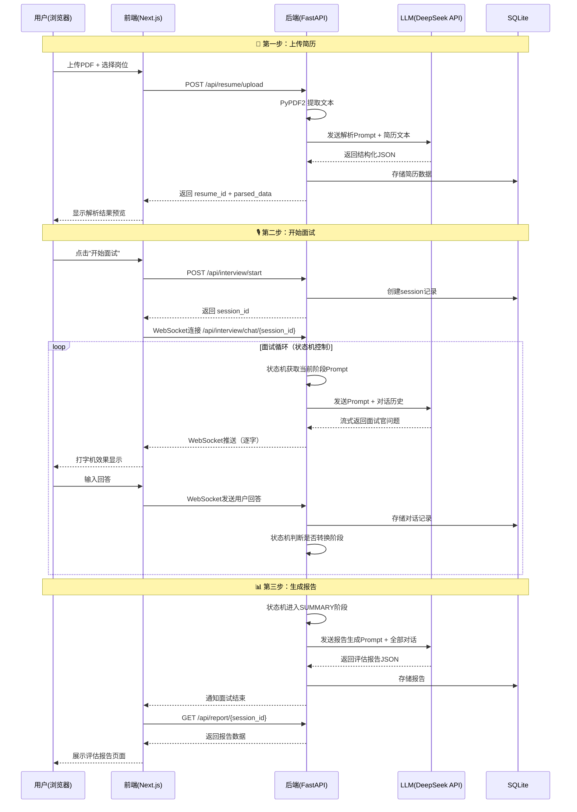

# 🎯 面试Agent系统 — MVP 开发计划（中期答辩版）

> **目标：** 在中期答辩前跑通核心链路，展示「上传简历 → AI面试对话 → 生成报告」的完整流程。
> **原则：** 能用API不造轮子，能用现成组件不手写UI，优先保证链路通，再打磨细节。

---

## 一、MVP 功能范围（砍到最精简）

| 优先级 | 功能模块 | 中期答辩是否必须 | 说明 |
|--------|---------|:-----------:|------|
| P0 | 简历上传 & PDF解析 | ✅ | 上传PDF，提取文本并结构化 |
| P0 | AI面试对话（文字） | ✅ | 基于简历内容的多轮追问对话 |
| P0 | 面试流程控制（状态机） | ✅ | 开场→八股→项目深挖→结束，自动跳转 |
| P1 | 面试评估报告 | ✅ | 面试结束后生成多维度评分+点评 |
| P2 | 语音交互（TTS/ASR） | ❌ | 中期先展示文字版，后续再加 |
| P2 | 代码考核模块 | ❌ | 后续再加 |
| P2 | 面试官人设切换 | ❌ | 后续再加，MVP先用默认人设 |

---

## 二、技术栈确认

| 层级 | 技术 | 版本建议 | 说明 |
|------|------|---------|------|
| **前端** | Next.js | 14+ (App Router) | React框架，SSR |
| **前端UI** | Tailwind CSS + ShadcnUI | 最新 | 快速搭建精美聊天界面 |
| **前端状态** | Zustand | 4+ | 轻量状态管理 |
| **后端** | FastAPI (Python) | 0.110+ | 异步API，自带Swagger |
| **AI框架** | LangChain | 0.2+ | Agent/Memory/Chain 管理 |
| **LLM** | DeepSeek API | - | 性价比高，中文效果好 |
| **数据库** | SQLite | - | MVP阶段够用，零配置 |
| **ORM** | SQLAlchemy | 2.0+ | Python ORM |
| **PDF解析** | PyPDF2 / pdfplumber | - | 简历PDF提取 |
| **通信** | WebSocket | - | 流式输出打字机效果 |

---

## 三、项目目录结构

```
Interview-Agent/
├── frontend/                          # Next.js 前端
│   ├── app/
│   │   ├── layout.tsx                 # 全局布局
│   │   ├── page.tsx                   # 首页（上传简历入口）
│   │   ├── interview/
│   │   │   └── page.tsx               # 面试对话页面
│   │   └── report/
│   │       └── page.tsx               # 面试报告页面
│   ├── components/
│   │   ├── ui/                        # ShadcnUI 组件（自动生成）
│   │   ├── ChatWindow.tsx             # 聊天窗口主组件
│   │   ├── ChatMessage.tsx            # 单条消息气泡
│   │   ├── ChatInput.tsx              # 输入框+发送按钮
│   │   ├── ResumeUploader.tsx         # 简历上传组件
│   │   ├── InterviewProgress.tsx      # 面试进度指示器（当前阶段）
│   │   └── ReportCard.tsx             # 评估报告卡片
│   ├── lib/
│   │   ├── api.ts                     # 后端API调用封装
│   │   └── websocket.ts              # WebSocket连接管理
│   ├── store/
│   │   └── useInterviewStore.ts       # Zustand 状态管理
│   ├── package.json
│   ├── tailwind.config.ts
│   └── tsconfig.json
│
├── backend/                           # FastAPI 后端
│   ├── main.py                        # FastAPI 应用入口
│   ├── config.py                      # 配置文件（API Key等）
│   ├── requirements.txt               # Python 依赖
│   │
│   ├── api/                           # API 路由
│   │   ├── __init__.py
│   │   ├── resume.py                  # POST /api/resume/upload - 简历上传
│   │   ├── interview.py               # WebSocket /api/interview/chat - 面试对话
│   │   └── report.py                  # GET /api/report/{session_id} - 获取报告
│   │
│   ├── services/                      # 业务逻辑层
│   │   ├── __init__.py
│   │   ├── resume_parser.py           # 简历解析服务
│   │   ├── interview_agent.py         # 面试Agent核心（状态机+LLM）
│   │   └── report_generator.py        # 报告生成服务
│   │
│   ├── agent/                         # AI Agent 核心
│   │   ├── __init__.py
│   │   ├── prompts.py                 # 所有 Prompt 模板
│   │   ├── state_machine.py           # 面试流程状态机
│   │   ├── memory.py                  # 对话记忆管理（LangChain Memory）
│   │   └── chains.py                  # LangChain Chains 定义
│   │
│   ├── models/                        # 数据模型
│   │   ├── __init__.py
│   │   ├── database.py                # SQLAlchemy 引擎和Session
│   │   ├── resume.py                  # 简历数据模型
│   │   ├── interview.py               # 面试会话数据模型
│   │   └── schemas.py                 # Pydantic 请求/响应模型
│   │
│   └── utils/                         # 工具函数
│       ├── __init__.py
│       └── pdf_utils.py               # PDF处理工具
│
├── readme.md                          # 项目说明
└── mvp-plan.md                        # 本文档
```

---

## 四、核心代码模块设计

### 4.1 后端 API 接口设计

| 方法 | 路径 | 功能 | 请求/响应 |
|------|------|------|----------|
| `POST` | `/api/resume/upload` | 上传并解析简历 | 请求: FormData(file) → 响应: `{resume_id, parsed_data}` |
| `POST` | `/api/interview/start` | 创建面试会话 | 请求: `{resume_id, position}` → 响应: `{session_id}` |
| `WebSocket` | `/api/interview/chat/{session_id}` | 面试实时对话 | 双向消息: `{role, content, stage}` |
| `POST` | `/api/interview/end/{session_id}` | 结束面试 | 响应: `{report_id}` |
| `GET` | `/api/report/{session_id}` | 获取评估报告 | 响应: `{scores, comments, suggestions}` |

### 4.2 面试Agent状态机（核心算法亮点）

```python
# backend/agent/state_machine.py 伪代码

from enum import Enum

class InterviewStage(Enum):
    OPENING = "opening"           # 开场寒暄
    BASIC_QA = "basic_qa"         # 基础知识/八股文
    PROJECT_DEEP = "project_deep" # 项目经历深挖
    SUMMARY = "summary"           # 总结阶段

class InterviewStateMachine:
    """面试流程状态机 - 控制Agent在不同阶段的行为"""

    def __init__(self, resume_data: dict, position: str):
        self.stage = InterviewStage.OPENING
        self.resume_data = resume_data
        self.position = position
        self.question_count = {stage: 0 for stage in InterviewStage}
        self.max_questions = {
            InterviewStage.OPENING: 1,      # 开场1轮
            InterviewStage.BASIC_QA: 3,     # 八股3题
            InterviewStage.PROJECT_DEEP: 3, # 项目追问3轮
            InterviewStage.SUMMARY: 1,      # 总结1轮
        }

    def get_current_prompt(self) -> str:
        """根据当前阶段返回对应的Prompt模板"""
        ...

    def should_transition(self, user_response: str) -> bool:
        """判断是否应该跳转到下一个阶段"""
        # 1. 当前阶段问题数达到上限
        # 2. 或者LLM判断当前话题已经聊透
        ...

    def next_stage(self) -> InterviewStage:
        """跳转到下一阶段"""
        ...
```

### 4.3 Prompt 模板设计（关键）

```python
# backend/agent/prompts.py

# 简历解析Prompt
RESUME_PARSE_PROMPT = """
你是一个专业的简历分析师。请从以下简历文本中提取结构化信息，以JSON格式输出：
{
  "name": "姓名",
  "education": "学历信息",
  "skills": ["技能1", "技能2"],
  "projects": [
    {
      "name": "项目名",
      "description": "项目描述",
      "tech_stack": ["技术1"],
      "role": "角色",
      "highlights": ["亮点1"]
    }
  ],
  "work_experience": [...]
}

简历内容：
{resume_text}
"""

# 面试官系统Prompt
INTERVIEWER_SYSTEM_PROMPT = """
你是一位资深的{position}面试官，正在面试一位候选人。

候选人简历信息：
{resume_summary}

当前面试阶段：{current_stage}
已问问题数：{question_count}

面试规则：
1. 每次只问一个问题，等候选人回答后再继续
2. 根据候选人的回答质量决定是否追问
3. 如果回答不完整或有错误，请温和地引导追问
4. 使用中文交流，保持专业但友好的态度
5. 在项目深挖阶段，使用STAR法则（情境-任务-行动-结果）进行追问

{stage_specific_instruction}
"""

# 评估报告生成Prompt
REPORT_PROMPT = """
根据以下面试对话记录，生成面试评估报告。

对话记录：
{conversation_history}

请以JSON格式输出评估报告：
{
  "overall_score": 0-100,
  "dimensions": {
    "technical_depth": {"score": 0-100, "comment": "..."},
    "communication": {"score": 0-100, "comment": "..."},
    "logic_thinking": {"score": 0-100, "comment": "..."},
    "project_experience": {"score": 0-100, "comment": "..."}
  },
  "strengths": ["优点1", "优点2"],
  "weaknesses": ["不足1", "不足2"],
  "suggestions": ["建议1", "建议2"],
  "question_reviews": [
    {
      "question": "面试问题",
      "answer_quality": "好/一般/差",
      "comment": "点评",
      "reference_answer": "参考答案"
    }
  ]
}
"""
```

### 4.4 前端核心页面

#### 首页（简历上传）
```
┌─────────────────────────────────────────┐
│           🎯 AI 面试官系统               │
│                                          │
│   ┌──────────────────────────────┐      │
│   │                              │      │
│   │    📄 拖拽上传你的简历(PDF)    │      │
│   │                              │      │
│   └──────────────────────────────┘      │
│                                          │
│   目标岗位: [  Java后端开发工程师  ▼]     │
│                                          │
│           [ 🚀 开始面试 ]                │
└─────────────────────────────────────────┘
```

#### 面试对话页
```
┌───────────────────────────────────────────────┐
│  面试进行中  ● 阶段: 项目深挖 (3/4)           │
├───────────────────────────────────────────────┤
│                                               │
│  🤖 面试官:                                   │
│  ┌─────────────────────────────────────┐      │
│  │ 你在简历中提到了一个微服务项目，能具   │      │
│  │ 体说说你在其中负责了哪些模块吗？       │      │
│  └─────────────────────────────────────┘      │
│                                               │
│                            👤 你:             │
│      ┌─────────────────────────────────┐      │
│      │ 我主要负责了用户服务和订单服务... │      │
│      └─────────────────────────────────┘      │
│                                               │
│  🤖 面试官:                                   │
│  ┌─────────────────────────────────────┐      │
│  │ 不错。那在这两个服务之间是如何通信的？ │      │
│  │ 遇到过数据一致性的问题吗？            │      │
│  └─────────────────────────────────────┘      │
│                                               │
├───────────────────────────────────────────────┤
│  [  输入你的回答...                    ] [发送] │
└───────────────────────────────────────────────┘
```

#### 评估报告页
```
┌─────────────────────────────────────────────┐
│           📊 面试评估报告                     │
├─────────────────────────────────────────────┤
│  综合评分: ★★★★☆  78/100                    │
│                                              │
│  ┌──────────┐ ┌──────────┐ ┌──────────┐    │
│  │ 技术深度  │ │ 沟通表达  │ │ 逻辑思维  │    │
│  │   72/100  │ │   85/100  │ │   80/100  │    │
│  └──────────┘ └──────────┘ └──────────┘    │
│                                              │
│  ✅ 优点: 项目经验丰富，表达清晰             │
│  ⚠️ 不足: 基础知识有待加强                   │
│                                              │
│  📝 逐题点评:                                │
│  Q1: xxx  → 回答质量: ★★★☆☆  ...            │
│  Q2: xxx  → 回答质量: ★★★★☆  ...            │
└─────────────────────────────────────────────┘
```

---

## 五、关键文件代码说明

### 5.1 需要编写的后端文件清单

| 文件 | 代码量估算 | 核心职责 |
|------|----------|---------|
| `main.py` | ~50行 | FastAPI应用入口，挂载路由，CORS配置 |
| `config.py` | ~30行 | 环境变量、API Key、模型配置 |
| `api/resume.py` | ~60行 | 简历上传接口，接收PDF并调用解析服务 |
| `api/interview.py` | ~100行 | WebSocket面试对话接口，流式返回 |
| `api/report.py` | ~40行 | 获取评估报告接口 |
| `services/resume_parser.py` | ~80行 | PDF文本提取 + LLM结构化解析 |
| `services/interview_agent.py` | ~150行 | **核心！** 组装Agent：状态机+Memory+LLM调用 |
| `services/report_generator.py` | ~60行 | 收集对话历史，调用LLM生成报告 |
| `agent/prompts.py` | ~100行 | 所有Prompt模板集中管理 |
| `agent/state_machine.py` | ~120行 | **核心！** 面试流程状态机 |
| `agent/memory.py` | ~50行 | LangChain ConversationBufferMemory 封装 |
| `agent/chains.py` | ~80行 | LangChain Chain 定义 |
| `models/database.py` | ~40行 | SQLAlchemy引擎初始化 |
| `models/resume.py` | ~30行 | 简历ORM模型 |
| `models/interview.py` | ~40行 | 面试会话ORM模型 |
| `models/schemas.py` | ~60行 | Pydantic Schema定义 |

**后端总计约 ~1100行**

### 5.2 需要编写的前端文件清单

| 文件 | 代码量估算 | 核心职责 |
|------|----------|---------|
| `app/layout.tsx` | ~30行 | 全局布局、字体、主题 |
| `app/page.tsx` | ~80行 | 首页：简历上传+岗位选择 |
| `app/interview/page.tsx` | ~120行 | 面试对话主页面 |
| `app/report/page.tsx` | ~100行 | 评估报告展示页 |
| `components/ChatWindow.tsx` | ~80行 | 聊天窗口容器，消息列表滚动 |
| `components/ChatMessage.tsx` | ~50行 | 单条消息气泡（区分AI/用户） |
| `components/ChatInput.tsx` | ~60行 | 输入框，回车/按钮发送 |
| `components/ResumeUploader.tsx` | ~70行 | 拖拽上传PDF组件 |
| `components/InterviewProgress.tsx` | ~40行 | 面试阶段进度条 |
| `components/ReportCard.tsx` | ~80行 | 报告评分卡片 |
| `lib/api.ts` | ~50行 | axios/fetch 封装 |
| `lib/websocket.ts` | ~60行 | WebSocket连接、重连、消息处理 |
| `store/useInterviewStore.ts` | ~60行 | Zustand：对话消息、面试状态 |

**前端总计约 ~880行**

---

## 六、数据库设计（SQLite）

```sql
-- 简历表
CREATE TABLE resumes (
    id          INTEGER PRIMARY KEY AUTOINCREMENT,
    filename    TEXT NOT NULL,
    raw_text    TEXT,               -- PDF提取的原始文本
    parsed_json TEXT,               -- LLM解析后的结构化JSON
    created_at  DATETIME DEFAULT CURRENT_TIMESTAMP
);

-- 面试会话表
CREATE TABLE interview_sessions (
    id          INTEGER PRIMARY KEY AUTOINCREMENT,
    resume_id   INTEGER REFERENCES resumes(id),
    position    TEXT NOT NULL,       -- 目标岗位
    status      TEXT DEFAULT 'in_progress',  -- in_progress / completed
    current_stage TEXT DEFAULT 'opening',
    created_at  DATETIME DEFAULT CURRENT_TIMESTAMP,
    ended_at    DATETIME
);

-- 对话记录表
CREATE TABLE messages (
    id          INTEGER PRIMARY KEY AUTOINCREMENT,
    session_id  INTEGER REFERENCES interview_sessions(id),
    role        TEXT NOT NULL,       -- 'interviewer' / 'candidate'
    content     TEXT NOT NULL,
    stage       TEXT,               -- 消息所属阶段
    created_at  DATETIME DEFAULT CURRENT_TIMESTAMP
);

-- 评估报告表
CREATE TABLE reports (
    id          INTEGER PRIMARY KEY AUTOINCREMENT,
    session_id  INTEGER REFERENCES interview_sessions(id),
    overall_score INTEGER,
    report_json TEXT,               -- 完整报告JSON
    created_at  DATETIME DEFAULT CURRENT_TIMESTAMP
);
```

---

## 七、MVP 核心流程时序图



---

## 八、依赖清单

### 后端 `requirements.txt`
```
fastapi>=0.110.0
uvicorn>=0.27.0
python-multipart>=0.0.6
websockets>=12.0
sqlalchemy>=2.0.25
langchain>=0.2.0
langchain-openai>=0.1.0
pdfplumber>=0.11.0
pydantic>=2.5.0
python-dotenv>=1.0.0
```

### 前端 `package.json` 关键依赖
```json
{
  "dependencies": {
    "next": "^14.1.0",
    "react": "^18.2.0",
    "react-dom": "^18.2.0",
    "zustand": "^4.5.0",
    "axios": "^1.6.0",
    "lucide-react": "^0.300.0",
    "class-variance-authority": "^0.7.0",
    "clsx": "^2.1.0",
    "tailwind-merge": "^2.2.0"
  },
  "devDependencies": {
    "tailwindcss": "^3.4.0",
    "typescript": "^5.3.0",
    "@types/react": "^18.2.0"
  }
}
```

---

## 九、中期答辩 Checklist ✅

- [ ] 前端首页可上传简历PDF并预览解析结果
- [ ] 后端能接收PDF、提取文本、调用LLM结构化解析
- [ ] WebSocket对话通道跑通，前后端实时通信
- [ ] 面试Agent能根据简历内容提出针对性问题
- [ ] 面试状态机能自动控制阶段转换（至少3个阶段）
- [ ] 对话有打字机效果（流式输出）
- [ ] 面试结束后能生成评估报告（评分+点评）
- [ ] Swagger文档能正常访问（截图用）
- [ ] 准备2-3个不同简历做演示Demo

---

## 十、快速启动命令

```bash
# 后端
cd backend
pip install -r requirements.txt
cp .env.example .env  # 填入 DEEPSEEK_API_KEY
uvicorn main:app --reload --port 8000

# 前端
cd frontend
npm install
npm run dev  # 默认 http://localhost:3000
```

---

> **预估总工作量：** 后端约1100行 + 前端约880行 ≈ **2000行代码**
> **预估开发时间：** 集中编码 **3-5天** 可完成MVP核心功能
